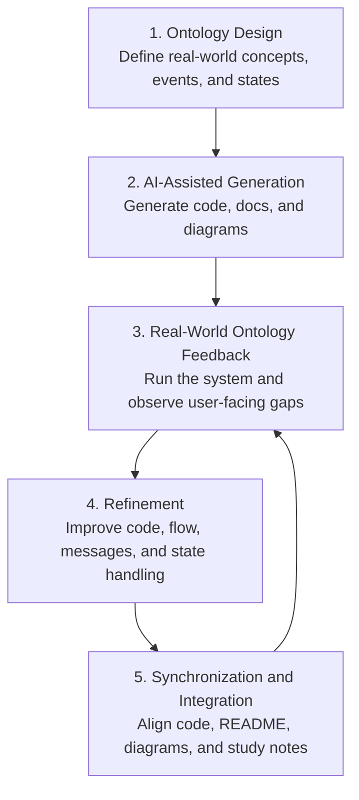

# AI-Assisted Development Playbook

This playbook summarizes the most important lesson I learned while building a Java 21 Virtual Thread cafe order system with AI assistance.

The project began as a small Java CRUD assignment, but the development process revealed a larger software engineering lesson:

> AI-generated code becomes truly useful only after it is tested against real-world workflow, user feedback, domain meaning, and documentation consistency.

---

## Core Model

```text
1. Ontology design
2. AI-assisted generation
3. Real-world ontology feedback
4. Refinement
5. Synchronization and integration of fragmented artifacts
```



---

## 1. Ontology Design

Before generating code, I define the real-world concepts that the system must represent.

For the cafe order system, the important concepts were:

```text
customer
menu item
quantity
takeout option
discount policy
payment confirmation
order status
background processing
sales reflection
cancellation
```

This matters because a program is not just a group of classes. It is a model of a real workflow.

If the real workflow is unclear, AI may generate code that is syntactically correct but operationally incomplete.

---

## 2. AI-Assisted Generation

AI is very useful for quickly generating the first version:

```text
classes
CRUD logic
collections
enum
Stream API search/filter
exception handling
README draft
Mermaid diagrams
```

The strength of AI at this stage is speed.

However, speed does not guarantee product completeness.

---

## 3. Real-World Ontology Feedback

After running the program, I found issues that were not simple syntax errors.

They were real-world workflow gaps:

```text
Payment was completed, but the user could not clearly feel that sales were reflected.
The menu returned too quickly after an action.
The daily sales screen did not show which orders were included.
Canceled orders needed to be excluded from sales.
Menu labels needed to match actual behavior exactly.
```

This kind of feedback is important because it connects code to user experience and business meaning.

---

## 4. Refinement

Based on the feedback, I refined the system:

```text
renamed menu option 1 to Create Order and Payment
displayed expected payment amount
added payment completion message
showed sales reflection immediately after saving an order
added order list and order count to the daily sales screen
added Press Enter to continue after each feature
confirmed canceled orders are excluded from sales
```

This stage turns AI-generated code into software that better matches real user behavior.

---

## 5. Synchronization and Integration

AI-assisted development can create many artifacts quickly:

```text
source code
README files
design documents
Mermaid diagrams
study guides
English portfolio documents
Virtual Thread comparison documents
```

As the program changes, these artifacts can easily become inconsistent.

Therefore, synchronization is a serious engineering task:

```text
code update
execution check
README update
diagram update
study guide update
variant project comparison
outdated expression search
final verification
```

This is especially important when working with AI, because generation is fast but integration still requires human judgment.

---

## Why This Matters for AI Backend Engineering

AI agent systems are not only technical systems.

They are workflow systems.

A production AI backend may involve:

```text
LLM API calls
vector search
tool execution
memory retrieval
user confirmation
state transition
audit logging
human feedback
multi-agent coordination
```

If the ontology is weak, the system may run but still feel unreliable or incomplete.

If feedback is weak, users cannot understand what the system did.

If synchronization is weak, code and documentation drift apart.

This is why I see AI-assisted development as a loop:

```text
model the world
generate the system
test against reality
refine the details
integrate the artifacts
repeat
```

---

## Personal Takeaway

The most important skill is not simply prompting AI to write code.

The more valuable skill is guiding AI with domain ontology, testing generated code against real workflows, and integrating scattered outputs into a coherent product.

This is the direction I want to develop further as a backend engineer working on AI agent systems.
