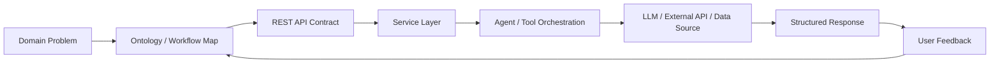

# AI Multi-Agent Orchestration Portfolio

## Core Positioning

```text
Domain problem structuring
+ AI-assisted implementation
+ Java 21 concurrent backend architecture
+ ontology feedback loops
= AI-native multi-agent orchestration PM
```

This repository is not just a collection of coding exercises.

It is a portfolio of how I learn, design, and orchestrate AI-backed systems: turning messy domain problems into structured workflows, executable backend prototypes, feedback loops, and reusable architectural knowledge.

My target role is not a narrow code-only position. I am building toward an AI-native Technical PM / backend orchestration role that can connect domain context, APIs, agents, documentation, and engineering execution.

My focus is on building backend systems that connect real-world workflows, AI-assisted development, Java concurrency, and practical user feedback loops.

## Why This Repository Exists

AI products are not built by one model call.

Real systems need orchestration:

- user request flow
- API contracts
- service boundaries
- agent roles
- tool execution
- error handling
- observability
- feedback from real usage
- documentation that stays aligned with the product

This repository records that practice.

The main question is:

```text
How do I turn fragmented AI-generated outputs into one coherent, testable, explainable system?
```

## Architecture Map



This repository is the engineering side of my ontology-driven AI direction.

The related ontology work focuses on how to structure complex domain knowledge. This repository focuses on how that structure can become backend code, agent flow, concurrency design, and product behavior.

## Featured Insight: AI-Assisted Development Lessons

The most valuable output of this repository is not only the Java code.

It is the development lesson I learned while using AI as a coding partner:

> AI-assisted development is an iterative process of designing ontology, generating with AI, correcting through real-world feedback, and synchronizing fragmented artifacts into one coherent product.

I documented this process as a practical playbook:

[`AI-Assisted Development Playbook`](AI_ASSISTED_DEVELOPMENT_PLAYBOOK.md)

Core model:

```text
1. Ontology design
2. AI-assisted generation
3. Real-world ontology feedback
4. Refinement
5. Synchronization and integration
```

This is especially important for AI agent systems because technical correctness alone is not enough. The system must also reflect real workflows, visible user feedback, state transitions, and documentation consistency.

## Featured Project

### Java 21 Virtual Thread Cafe Order System

Path:

[`portfolio/java21-virtual-thread-cafe-order-system`](portfolio/java21-virtual-thread-cafe-order-system)

This project started as a Java console CRUD assignment and was refactored into a Java 21 Virtual Thread edition.

It demonstrates how a small domain application can be extended into a backend architecture learning project:

- Java 21 Virtual Threads
- asynchronous background order processing
- JVM memory optimization concepts
- CRUD and layered architecture
- enum-based state modeling
- Stream API search and filtering
- real-world ontology feedback
- user-facing interaction refinement
- documentation synchronization across code, diagrams, and study notes

## Why This Project Matters

Modern AI services often spend a large amount of time waiting for network I/O:

- external LLM API calls
- vector database retrieval
- embedding generation
- tool execution
- multi-agent coordination
- database and message queue operations

Java 21 Virtual Threads are useful for this kind of workload because they allow many waiting tasks to be handled with much lower thread overhead than traditional platform threads.

The console project itself is intentionally small, so the speed difference is not visually dramatic. The architectural lesson is much larger: when the system grows into an AI multi-agent backend, lightweight concurrency becomes a practical advantage.

## Development Philosophy

This repository documents an AI-assisted development process:

```text
1. Ontology design
2. AI-assisted generation
3. Real-world ontology feedback
4. Refinement
5. Synchronization and integration of fragmented artifacts
```

The key idea is that AI-generated code should not be accepted blindly.

It must be executed, observed, corrected through real user feedback, and synchronized across code, README files, diagrams, and study documents.

## Main Documents

- [Java 21 Virtual Thread Cafe Order System](portfolio/java21-virtual-thread-cafe-order-system)
- [English README](portfolio/java21-virtual-thread-cafe-order-system/README_EN.md)
- [AI Development Lessons](portfolio/java21-virtual-thread-cafe-order-system/AI_DEVELOPMENT_LESSONS_EN.md)
- [Normal vs Virtual Thread Design](portfolio/java21-virtual-thread-cafe-order-system/NORMAL_VS_VIRTUAL_THREAD_DESIGN.md)
- [Virtual Thread Refactoring Guide](portfolio/java21-virtual-thread-cafe-order-system/VIRTUAL_THREAD_REFACTORING_GUIDE.md)

## Current Direction

I am especially interested in backend orchestration for AI agent systems, including:

- Java and Spring-based AI services
- multi-agent orchestration
- memory-efficient concurrent architecture
- domain ontology modeling
- real-world feedback loops
- legal, medical, administrative, and other knowledge-heavy domains

The long-term direction is to connect this orchestration practice with Legal/Medical AI systems, safe RAG architecture, guardrails, API contracts, observability, and Java 21 Virtual Threads for waiting-heavy AI workloads.
