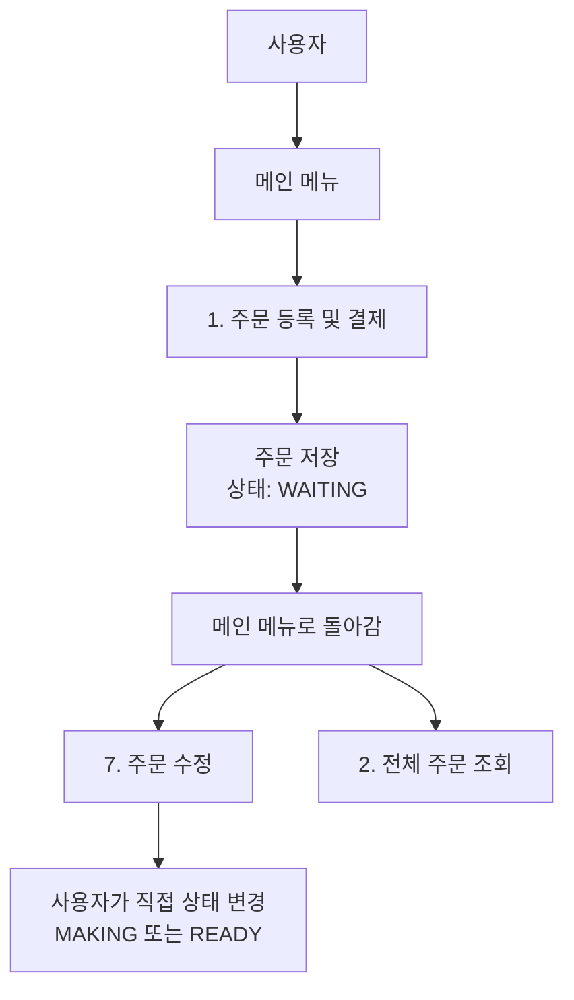
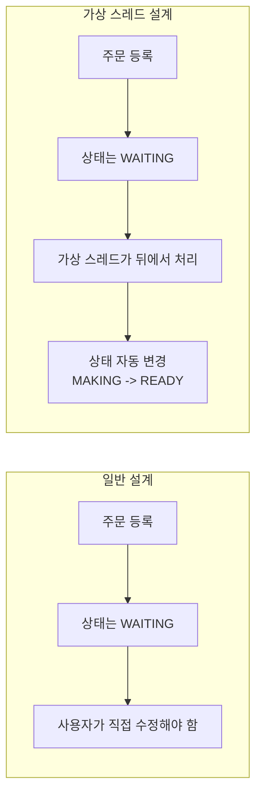
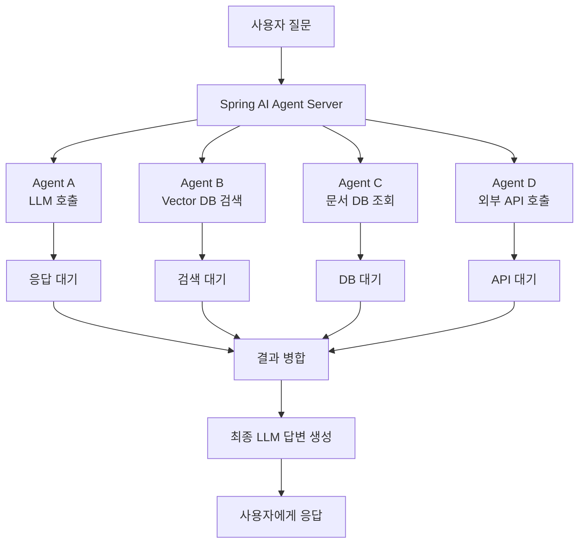
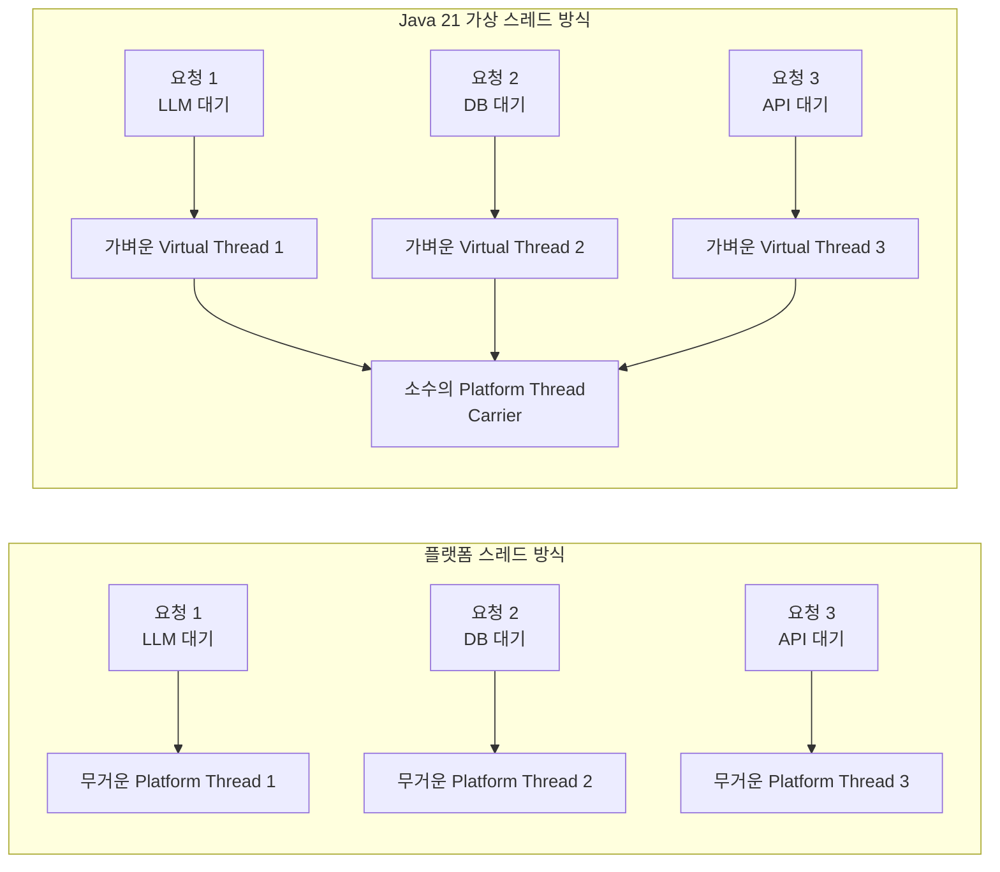

# 일반 설계와 Java 21 가상 스레드 설계 비교

이 문서는 카페 주문 관리 프로그램을 기준으로, 일반적인 콘솔 프로그램 설계와 Java 21 가상 스레드 설계가 어떻게 다른지 설명합니다.

작은 프로그램에서는 속도 차이가 거의 체감되지 않지만, 대형 AI Multi-Agent 서버처럼 외부 API와 DB 대기가 많은 프로그램에서는 차이가 크게 나타날 수 있습니다.

---

## 1. 한 줄 요약

일반 설계는 사용자가 직접 상태를 바꾸는 **동기식 흐름**에 가깝습니다.

가상 스레드 설계는 주문 등록 및 결제 후 제조 작업처럼 기다리는 일을 **백그라운드 가상 스레드**에 맡깁니다.

```text
일반 설계:
사용자가 직접 모든 흐름을 진행한다.

가상 스레드 설계:
사용자 흐름은 계속 유지하고, 기다리는 작업은 뒤에서 처리한다.
```

---

## 2. 일반 설계 흐름



### 초보자 설명

일반 버전에서는 주문을 등록하면 상태가 `접수 대기`로 저장됩니다.

그 뒤 상태를 바꾸려면 사용자가 직접 `7. 주문 수정` 메뉴에 들어가야 합니다.

```text
주문 등록
-> 접수 대기
-> 사용자가 직접 수정
-> 제조 중 또는 준비 완료
```

즉, 모든 흐름이 사용자의 메뉴 선택에 의존합니다.

최신 버전에서는 주문 저장 직후 현재 매출 합계가 바로 출력되고, 사용자가 Enter를 눌러야 다음 메뉴로 넘어갑니다.

---

## 3. Java 21 가상 스레드 설계 흐름

```mermaid
flowchart TD
    User["사용자"]
    Menu["메인 메뉴"]
    Create["1. 주문 등록 및 결제"]
    Save["주문 저장<br/>상태: WAITING"]
    Processor["VirtualThreadOrderProcessor"]
    VT["Java 21 Virtual Thread"]
    Making["상태 변경<br/>MAKING 제조 중"]
    Wait["제조 시간 대기<br/>Thread.sleep"]
    Ready["상태 변경<br/>READY 준비 완료"]
    Back["메인 메뉴 계속 사용"]
    Read["2. 전체 주문 조회"]

    User --> Menu
    Menu --> Create
    Create --> Save
    Save --> Processor
    Processor --> VT
    VT --> Making
    Making --> Wait
    Wait --> Ready
    Save --> Back
    Back --> Read
```



### 초보자 설명

가상 스레드 버전에서는 주문 등록 및 결제가 끝나면, 별도의 가상 스레드가 제조 작업을 시작합니다.

사용자는 메뉴를 계속 사용할 수 있고, 주문 상태는 뒤에서 자동으로 바뀝니다.

```text
주문 등록 및 결제
-> 접수 대기
-> 가상 스레드가 뒤에서 제조 시작
-> 제조 중
-> 준비 완료
```

즉, 사용자가 직접 7번 수정 메뉴로 상태를 바꾸지 않아도 됩니다.

주문 저장 직후에는 매출 반영 메시지가 먼저 출력되고, 제조 상태 변경은 가상 스레드가 뒤에서 이어서 처리합니다.

---

## 4. 두 설계의 가장 큰 차이



| 항목 | 일반 설계 | 가상 스레드 설계 |
| --- | --- | --- |
| 주문 등록 및 결제 후 상태 | 접수 대기 유지 | 접수 대기 후 자동 변경 |
| 상태 변경 주체 | 사용자 | 백그라운드 가상 스레드 |
| 기다리는 작업 | 사용자가 직접 흐름을 진행해야 함 | 별도 작업으로 분리 가능 |
| 체감 포인트 | 단순하고 예측 가능 | 뒤에서 작업이 진행됨 |
| 결과 확인 방식 | 기능 후 Enter 대기 | 기능 후 Enter 대기 + 가상 스레드 로그 |
| 작은 프로그램에서 속도 차이 | 거의 없음 | 거의 없음 |
| 대형 서버에서 차이 | 동시 대기 작업이 많으면 부담 증가 | 많은 대기 작업을 더 가볍게 처리 가능 |

---

## 5. 왜 작은 프로그램에서는 체감이 적을까

이번 카페 프로그램은 매우 작습니다.

```text
사용자 1명
주문 1~2개
가상 스레드 1개
대기 시간 1.5초
```

이 정도 규모에서는 플랫폼 스레드와 가상 스레드의 차이를 속도로 느끼기 어렵습니다.

가상 스레드는 한 작업을 더 빠르게 만드는 기술이라기보다, **기다리는 작업을 많이 동시에 버티게 해주는 기술**입니다.

```text
작은 프로그램:
대기 작업이 적음
동시 요청이 거의 없음
속도 차이 체감 어려움

큰 서버:
대기 작업이 많음
동시 요청이 많음
스레드와 메모리 차이 체감 가능
```

---

## 6. 대형 AI Multi-Agent 서버에서는 왜 차이가 커질까

AI Multi-Agent 서버는 기다리는 작업이 많습니다.

예를 들어 한 사용자가 질문을 하면 내부에서 이런 일이 일어날 수 있습니다.

```text
사용자 질문 수신
-> Agent A가 LLM API 호출
-> Agent B가 벡터 DB 검색
-> Agent C가 문서 DB 조회
-> Agent D가 외부 검색 API 호출
-> 결과를 모아서 다시 LLM API 호출
-> 답변 생성
```

이 작업 대부분은 CPU 계산보다 외부 응답 대기입니다.

```text
LLM API 대기
벡터 DB 대기
문서 DB 대기
외부 API 대기
파일 저장소 대기
```

이때 일반 플랫폼 스레드 방식은 대기 작업마다 무거운 스레드를 오래 붙잡기 쉽습니다.

반면 Java 21 가상 스레드는 대기 작업을 훨씬 가볍게 다루기 좋습니다.

---

## 7. AI Multi-Agent 서버 흐름도



이런 구조에서는 동시에 기다리는 작업이 매우 많아질 수 있습니다.

카페 예제에서의 `Thread.sleep(1500)`은 실무 AI 서버에서는 이런 대기 작업과 비슷합니다.

```text
카페 제조 대기
= LLM API 응답 대기
= 벡터 DB 검색 대기
= 외부 API 호출 대기
```

---

## 8. 일반 플랫폼 스레드 방식과 가상 스레드 방식 비교



초보자 설명:

플랫폼 스레드 방식은 손님마다 직원을 한 명씩 붙이는 방식에 가깝습니다.

가상 스레드 방식은 손님마다 주문표를 만들고, 실제 직원은 필요한 순간에만 움직이는 방식에 가깝습니다.

```text
플랫폼 스레드:
기다리는 손님마다 직원이 묶임

가상 스레드:
손님은 주문표로 관리하고 직원은 필요한 순간에 움직임
```

---

## 9. 코드 차이

일반 버전에는 가상 스레드 처리기가 없습니다.

주문 등록 및 결제 후 상태는 그대로 `WAITING`입니다.

가상 스레드 버전에는 다음 클래스가 추가되었습니다.

```text
VirtualThreadOrderProcessor.java
```

핵심 코드:

```java
this.executorService = Executors.newVirtualThreadPerTaskExecutor();
```

이 코드는 작업마다 가상 스레드를 만들어 실행합니다.

주문 등록 및 결제 후 다음 코드가 실행됩니다.

```java
virtualThreadOrderProcessor.startProcessing(order.getId());
```

그러면 뒤에서 이런 일이 일어납니다.

```java
orderService.updateOrderStatus(orderId, OrderStatus.MAKING);
Thread.sleep(1500);
orderService.updateOrderStatus(orderId, OrderStatus.READY);
```

겉으로는 단순한 순서 코드처럼 보이지만, 메인 메뉴와 별개로 백그라운드 가상 스레드에서 실행됩니다.

---

## 10. 체험할 때 봐야 하는 차이

작은 프로젝트에서는 속도보다 상태 변화를 봐야 합니다.

### 일반 버전

```text
1. 주문 등록 및 결제
2. 전체 주문 조회
상태: 접수 대기
```

상태를 바꾸려면 직접:

```text
7. 주문 수정
2. 주문 상태 수정
```

으로 들어가야 합니다.

### 가상 스레드 버전

```text
1. 주문 등록 및 결제
잠깐 기다림
[가상 스레드] 제조 작업 시작
[가상 스레드] 제조 완료
2. 전체 주문 조회
상태: 준비 완료
```

즉, 체험 포인트는 이것입니다.

```text
내가 직접 바꾸지 않았는데 상태가 뒤에서 바뀐다.
```

---

## 11. 실무적 의미

이 작은 프로그램에서는 성능 차이가 거의 느껴지지 않습니다.

하지만 구조적 의미는 있습니다.

```text
일반 설계:
모든 흐름이 사용자 조작 중심

가상 스레드 설계:
사용자 흐름과 대기 작업을 분리
```

이 개념은 대형 AI 서버에서 매우 중요합니다.

```text
사용자 요청은 계속 받아야 함
LLM 응답은 오래 기다려야 함
벡터 DB 검색도 기다려야 함
외부 API도 기다려야 함
```

이런 환경에서는 기다리는 작업을 어떻게 처리하느냐가 서버 안정성과 비용에 영향을 줍니다.

가상 스레드는 대기 작업이 많은 서버에서 더 적은 스레드 부담으로 많은 요청을 처리하게 도와줍니다.

---

## 12. 최종 정리

이번 카페 프로그램에서 가상 스레드는 속도 향상보다 구조 학습용입니다.

작은 프로그램이라 체감 성능 차이는 거의 없습니다.

하지만 다음 개념을 경험할 수 있습니다.

```text
사용자 메뉴 흐름과 백그라운드 작업을 분리한다.
기다리는 작업을 가상 스레드에 맡긴다.
상태가 뒤에서 자동으로 바뀐다.
대형 AI 서버에서는 이런 대기 작업이 수천 개로 늘어날 수 있다.
그때 Java 21 가상 스레드의 차이가 커진다.
```

한 줄로 말하면:

> 이 작은 프로젝트에서는 가상 스레드의 속도 차이는 잘 안 느껴지지만, 대형 AI Multi-Agent 서버에서는 LLM, 벡터 DB, 외부 API 대기 작업이 많아져 가상 스레드의 장점이 크게 드러난다.

