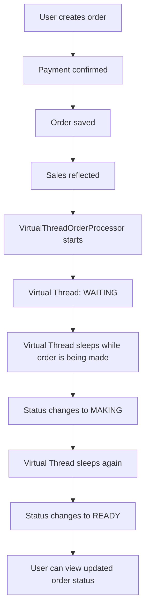
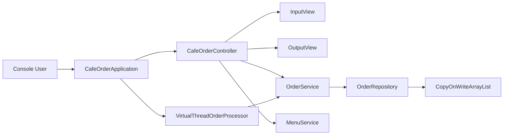

# Cafe Order Management System - Java 21 Virtual Thread Edition

This project is a Java 21 refactored version of a console-based cafe order management system.

The original assignment version is kept separate, while this version was created to explore Java 21 Virtual Threads, asynchronous background processing, and JVM memory optimization concepts.

It is intentionally small and beginner-friendly, but it demonstrates an important architectural idea used in larger AI and backend systems: when a task spends most of its time waiting, Virtual Threads can handle concurrency with much lower thread overhead than traditional platform threads.

---

## Project Purpose

The base assignment focuses on core Java concepts:

- classes and objects
- encapsulation
- inheritance and polymorphism
- collections
- exception handling
- enum
- lambda expressions
- Stream API
- CRUD
- separation of concerns

This Virtual Thread edition keeps those learning goals and adds Java 21-oriented backend concepts:

- background order processing
- Java 21 Virtual Threads
- safer concurrent collection usage
- JVM memory configuration
- user-visible asynchronous state changes

---

## Main Features

The console menu supports the following features:

```text
1. Create order and payment
2. View all orders
3. Find order by order number
4. Search by customer name
5. Search by menu name
6. Filter by order status
7. Update order
8. Delete order
9. View today's sales
0. Exit program
```

The program supports full CRUD for cafe orders:

- Create: register a new order and confirm payment
- Read: view all orders, search by order number, customer name, menu name, or status
- Update: modify an existing order
- Delete: cancel or remove an existing order

---

## What Makes This Version Different

Compared with the regular assignment version, this edition includes the following changes:

- order creation includes payment confirmation
- after payment, the order is saved and reflected in today's sales
- today's sales screen shows included order count, order list, and total amount
- canceled orders are excluded from sales calculation
- after each feature, the program waits for `Enter` so the user can read the result
- after order registration and payment, a Java 21 Virtual Thread starts background order processing
- order status changes in the background: `WAITING -> MAKING -> READY`
- `OrderRepository` uses `CopyOnWriteArrayList` for safer concurrent access
- JVM options demonstrate small-heap memory configuration

---

## Where Virtual Threads Are Used

The core Virtual Thread logic is in:

```text
src/main/java/com/assignment/cafe/service/VirtualThreadOrderProcessor.java
```

The processor creates a Virtual Thread executor:

```java
this.executorService = Executors.newVirtualThreadPerTaskExecutor();
```

After an order is created and payment is confirmed, the application starts background processing:

```java
virtualThreadOrderProcessor.startProcessing(order.getId());
```

This allows the order workflow to continue without blocking the main console flow.

---

## Virtual Thread Flow



---

## Why Java 21 Virtual Threads Matter

Traditional Java platform threads are relatively expensive because each thread owns a native OS thread and usually reserves a large stack memory area.

Virtual Threads are much lighter. They are managed by the JVM and are especially efficient when the task spends most of its time waiting.

This matters in modern AI backend systems because many AI workloads involve long network I/O waits:

- external LLM API calls
- vector database searches
- embedding model requests
- tool calls
- multi-agent coordination
- database and message queue operations

In a small console program, the performance difference is not easy to feel.

In a large AI multi-agent service, however, Virtual Threads can make a major difference because the server may need to handle many concurrent waiting tasks without creating thousands of heavy platform threads.

---

## Memory Optimization Points

This project includes several memory-aware design points:

- uses Java 21 Virtual Threads for lightweight background tasks
- avoids creating heavy platform threads for each waiting task
- configures a small JVM heap for learning purposes
- enables string deduplication option
- uses defensive copying for order items
- uses `CopyOnWriteArrayList` for safer read-heavy concurrent access

Gradle JVM options:

```text
-Xms32m
-Xmx128m
-XX:+UseStringDeduplication
```

These options are small-scale learning examples. In production, JVM settings should be tested with real traffic, metrics, and profiling tools.

---

## Architecture Overview



### Layer Responsibilities

```text
CafeOrderApplication
- controls the main menu loop
- connects controller and virtual-thread processor

CafeOrderController
- handles user actions
- coordinates input, output, and service logic

OrderService
- contains order business logic
- handles CRUD, search, update, delete, and sales calculation

OrderRepository
- stores order data in a collection
- uses CopyOnWriteArrayList for safer concurrent access

VirtualThreadOrderProcessor
- starts background processing with Java 21 Virtual Threads
- changes order status asynchronously

InputView / OutputView
- separates console input/output from business logic
```

---

## How to Run

Run with Gradle:

```powershell
.\gradlew.bat run
```

Or run the main class in IntelliJ:

```text
com.assignment.cafe.CafeOrderApplication
```

If Korean text is broken in the Windows console, use:

```powershell
.\run-utf8.bat
```

For IntelliJ, set VM options:

```text
-Dfile.encoding=UTF-8
-Dsun.stdout.encoding=UTF-8
-Dsun.stderr.encoding=UTF-8
```

---

## Related Documents

- Korean README: [`README.md`](README.md)
- Virtual Thread refactoring guide: [`VIRTUAL_THREAD_REFACTORING_GUIDE.md`](VIRTUAL_THREAD_REFACTORING_GUIDE.md)
- Normal vs Virtual Thread architecture comparison: [`NORMAL_VS_VIRTUAL_THREAD_DESIGN.md`](NORMAL_VS_VIRTUAL_THREAD_DESIGN.md)
- AI development lessons: [`AI_DEVELOPMENT_LESSONS.md`](AI_DEVELOPMENT_LESSONS.md)
- English AI development lessons: [`AI_DEVELOPMENT_LESSONS_EN.md`](AI_DEVELOPMENT_LESSONS_EN.md)

---

## Key Learning Summary

This project helped me understand that Java 21 Virtual Threads are not mainly about making a small console program feel faster.

Their real value appears when a backend system must handle many concurrent waiting tasks, such as LLM API calls, vector searches, database calls, and multi-agent workflows.

From a software design perspective, this version also shows that AI-assisted development requires more than code generation. It requires real execution, feedback, ontology correction, and synchronization across code, documentation, diagrams, and user experience.
