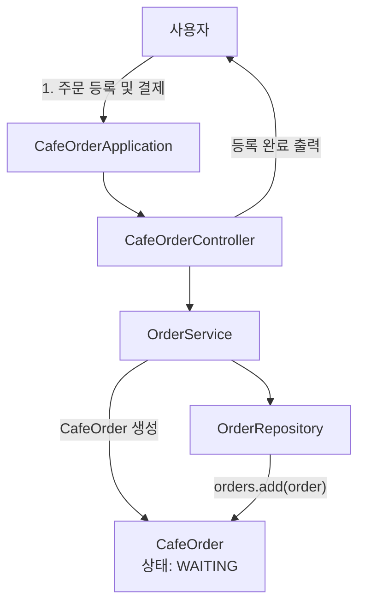
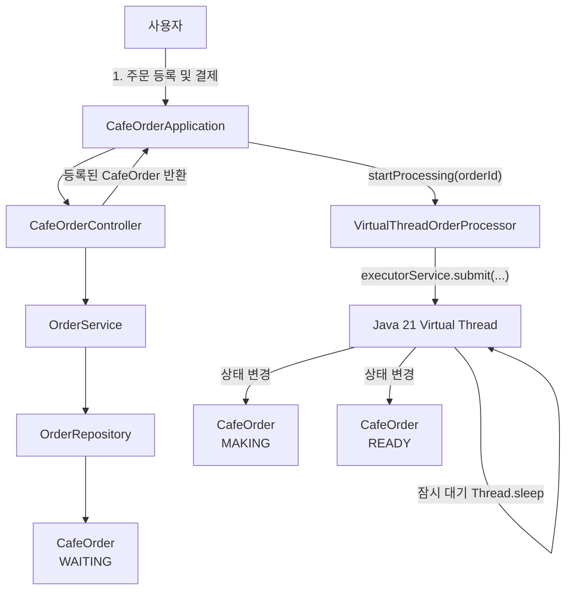
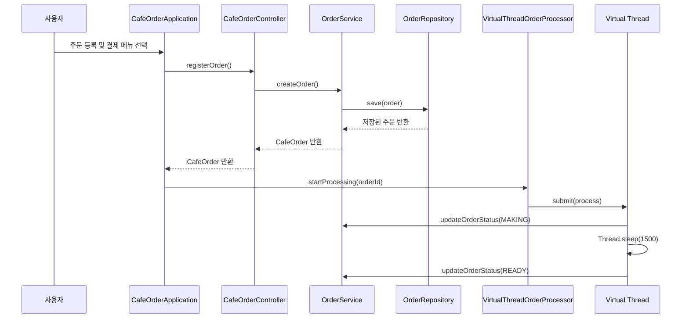
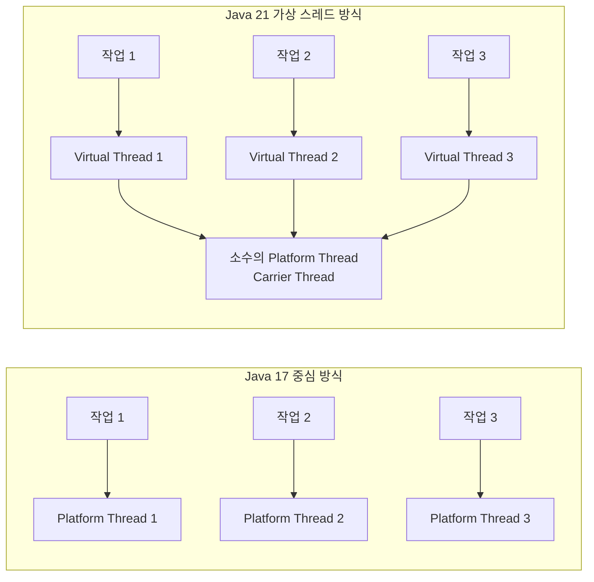

# Java 21 가상 스레드 리팩토링 설명서

이 문서는 `cafe-order-management-system-virtual-thread` 프로젝트가 원래 카페 주문 관리 프로그램에서 어떤 점을 리팩토링했는지, 그리고 그 변화가 실무적으로 어떤 의미를 가지는지 설명합니다.

코딩 초보자도 이해할 수 있도록 최대한 쉬운 말로 정리했습니다.

---

## 1. 리팩토링 한 줄 요약

기존 버전은 사용자가 메뉴를 선택하면 프로그램이 그 자리에서 바로 처리하는 **동기식 콘솔 프로그램**이었습니다.

가상 스레드 변형 버전은 주문을 등록한 뒤, 주문 제조 과정을 Java 21의 **가상 스레드**로 백그라운드에서 처리하도록 바꿨습니다.

```text
기존 버전:
주문 등록 및 결제
-> 상태는 접수 대기 그대로 유지

가상 스레드 버전:
주문 등록 및 결제
-> 가상 스레드가 백그라운드에서 제조 시작
-> WAITING
-> MAKING
-> READY
```

---

## 2. 원본 흐름과 리팩토링 후 흐름 비교

### 기존 흐름



기존 버전은 주문 등록 및 결제 후 주문 상태가 기본값인 `WAITING`에 머무릅니다.

사용자가 직접 수정 메뉴에서 상태를 바꾸지 않는 한, 자동으로 `MAKING`이나 `READY`가 되지 않습니다.

### 가상 스레드 리팩토링 후 흐름



리팩토링 후에는 주문 등록 및 결제가 끝난 뒤 `VirtualThreadOrderProcessor`가 별도의 가상 스레드 작업을 시작합니다.

이 가상 스레드는 주문 상태를 다음 순서로 바꿉니다.

```text
WAITING 접수 대기
-> MAKING 제조 중
-> READY 준비 완료
```

또한 최신 버전에서는 주문 저장 직후 다음 피드백도 즉시 출력합니다.

```text
[매출 반영] 현재 오늘 매출 합계: ...
계속하려면 Enter를 누르세요...
```

이 메시지는 사용자가 주문 저장과 매출 반영을 바로 체감하도록 추가한 interactive 개선입니다.

---

## 3. 어떤 파일이 바뀌었나

| 파일 | 리팩토링 내용 |
| --- | --- |
| `VirtualThreadOrderProcessor.java` | 새로 추가. 가상 스레드로 주문 제조 과정을 백그라운드 처리 |
| `CafeOrderApplication.java` | 주문 등록 및 결제 후 가상 스레드 처리기를 호출하도록 변경 |
| `CafeOrderController.java` | 등록된 주문 객체를 반환하도록 변경 |
| `OrderRepository.java` | `ArrayList`에서 `CopyOnWriteArrayList`로 변경 |
| `CafeOrder.java` | 백그라운드 상태 변경을 고려해 일부 필드에 `volatile` 적용 |
| `build.gradle` | Java 21 toolchain, 작은 힙 메모리, 문자열 중복 제거 옵션 추가 |

---

## 4. 핵심 리팩토링 1: 가상 스레드 처리기 추가

추가된 파일:

```text
src/main/java/com/assignment/cafe/service/VirtualThreadOrderProcessor.java
```

핵심 코드:

```java
this.executorService = Executors.newVirtualThreadPerTaskExecutor();
```

초보자 설명:

`Executors.newVirtualThreadPerTaskExecutor()`는 작업 하나마다 가상 스레드를 하나씩 만들어 실행합니다.

기존 플랫폼 스레드는 운영체제 스레드와 연결된 무거운 작업자라고 보면 됩니다.

가상 스레드는 JVM이 관리하는 가벼운 작업표에 가깝습니다.

```text
플랫폼 스레드:
작업자 1명 = 무거운 책상 1개

가상 스레드:
작업표 1장 = 가벼운 메모지
```

작업이 기다리는 시간이 많을수록 가상 스레드가 유리합니다.

---

## 5. 핵심 리팩토링 2: 주문 등록 및 결제 후 백그라운드 제조 시작

변경된 파일:

```text
CafeOrderApplication.java
```

핵심 코드:

```java
CafeOrder order = cafeOrderController.registerOrder(customerName, items, discountPolicy);

if (order != null) {
    virtualThreadOrderProcessor.startProcessing(order.getId());
}
```

초보자 설명:

기존에는 주문을 등록하고 끝났습니다.

리팩토링 후에는 주문 등록 및 결제 결과로 `CafeOrder` 객체를 돌려받고, 그 주문번호를 가상 스레드 처리기에 넘깁니다.

```text
주문 등록 및 결제 완료
-> 주문번호 확인
-> 가상 스레드로 제조 작업 시작
```

이 구조는 실무에서 자주 쓰입니다.

예를 들어:

```text
회원가입 완료
-> 환영 이메일 발송을 백그라운드 처리

주문 결제 완료
-> 배송 준비 작업을 백그라운드 처리

AI 질문 등록
-> LLM 응답 생성을 백그라운드 처리
```

---

## 6. 핵심 리팩토링 3: Controller가 등록 결과를 반환

변경된 파일:

```text
CafeOrderController.java
```

기존 개념:

```text
주문 등록 및 결제
-> 화면에 출력만 함
-> 등록된 주문 객체를 밖으로 돌려주지 않음
```

리팩토링 후:

```java
public CafeOrder registerOrder(String customerName, List<OrderItem> items, DiscountPolicy discountPolicy) {
    try {
        CafeOrder order = orderService.createOrder(customerName, items, discountPolicy);
        outputView.printMessage("[완료] 주문이 등록되었습니다.");
        outputView.printOrder(order);
        return order;
    } catch (IllegalArgumentException e) {
        outputView.printError(e.getMessage());
        return null;
    }
}
```

초보자 설명:

가상 스레드 제조 작업을 시작하려면 방금 등록된 주문번호가 필요합니다.

그래서 Controller가 등록된 `CafeOrder` 객체를 반환하도록 바꿨습니다.

```text
등록 성공 -> CafeOrder 반환
등록 실패 -> null 반환
```

---

## 7. 핵심 리팩토링 4: 주문 저장 컬렉션 변경

변경된 파일:

```text
OrderRepository.java
```

기존:

```java
private final List<CafeOrder> orders = new ArrayList<>();
```

리팩토링 후:

```java
private final List<CafeOrder> orders = new CopyOnWriteArrayList<>();
```

초보자 설명:

기존 버전에서는 한 번에 한 흐름만 주문 목록을 다뤘습니다.

하지만 가상 스레드 버전에서는 두 흐름이 동시에 생길 수 있습니다.

```text
메인 흐름:
사용자가 전체 주문 조회

백그라운드 흐름:
가상 스레드가 주문 상태 변경
```

이런 상황에서는 일반 `ArrayList`보다 동시 접근에 안전한 컬렉션이 더 적합합니다.

`CopyOnWriteArrayList`는 조회가 많고 수정이 적은 작은 프로그램에서 쓰기 편한 동시성 컬렉션입니다.

---

## 8. 핵심 리팩토링 5: volatile 적용

변경된 파일:

```text
CafeOrder.java
```

변경 코드:

```java
private volatile String customerName;
private volatile OrderStatus status;
```

초보자 설명:

`volatile`은 여러 스레드가 같은 값을 볼 때 최신 값이 보이도록 도와주는 키워드입니다.

이 프로젝트에서는 메인 메뉴 흐름과 가상 스레드 흐름이 같은 주문 객체를 볼 수 있습니다.

```text
가상 스레드:
주문 상태를 READY로 변경

메인 스레드:
전체 주문 조회
```

이때 메인 스레드가 오래된 상태값을 보는 일을 줄이기 위해 `status`에 `volatile`을 붙였습니다.

---

## 9. 핵심 리팩토링 6: JVM 메모리 옵션 추가

변경된 파일:

```text
build.gradle
```

추가 코드:

```gradle
applicationDefaultJvmArgs = [
        '-Xms32m',
        '-Xmx128m',
        '-XX:+UseStringDeduplication'
]
```

초보자 설명:

JVM은 Java 프로그램을 실행하는 가상 머신입니다.

`-Xms32m`은 프로그램 시작 시 힙 메모리를 32MB로 잡는다는 뜻입니다.

`-Xmx128m`은 최대 힙 메모리를 128MB로 제한한다는 뜻입니다.

`-XX:+UseStringDeduplication`은 같은 문자열이 많이 생길 때 중복을 줄이는 옵션입니다.

작은 콘솔 프로그램에서는 큰 차이가 나지 않지만, 실무에서는 이런 설정이 중요해질 수 있습니다.

```text
메모리 제한을 걸어둔다
-> 프로그램이 필요 이상으로 메모리를 먹지 않게 한다
-> 서버 한 대에 더 많은 프로그램을 안정적으로 띄울 수 있다
```

---

## 10. 가상 스레드 제조 작업 흐름



초보자 설명:

주문 등록 및 결제는 메인 흐름에서 처리됩니다.

하지만 제조 상태 변경은 가상 스레드에서 따로 처리됩니다.

즉, 사용자는 메뉴를 계속 사용할 수 있고, 제조 작업은 뒤에서 진행됩니다.

---

## 11. 실무적으로 어떤 의미가 있나

### 11-1. 기다리는 작업을 분리할 수 있다

실무 서버에서는 오래 걸리는 작업이 많습니다.

예를 들어:

```text
결제 승인 대기
이메일 발송 대기
외부 배송 API 호출
AI LLM 응답 대기
벡터 DB 검색 대기
파일 업로드 처리
```

이런 작업을 메인 요청 흐름에서 전부 기다리면 사용자는 느리다고 느낍니다.

가상 스레드를 쓰면 이런 작업을 더 가볍게 분리할 수 있습니다.

### 11-2. 코드가 비동기처럼 동작하지만 읽기는 쉽다

복잡한 비동기 코드는 초보자에게 어렵습니다.

예를 들어:

```java
future.thenCompose(...)
      .thenApply(...)
      .exceptionally(...);
```

가상 스레드를 쓰면 코드 흐름은 여전히 순서대로 읽힙니다.

```java
orderService.updateOrderStatus(orderId, OrderStatus.MAKING);
Thread.sleep(1500);
orderService.updateOrderStatus(orderId, OrderStatus.READY);
```

초보자 입장에서는 훨씬 이해하기 쉽습니다.

### 11-3. AI 서버와 연결하면 의미가 더 커진다

이 카페 프로젝트에서는 `Thread.sleep(1500)`으로 제조 대기를 흉내 냈습니다.

실무 AI 서버에서는 이 자리가 다음 작업으로 바뀔 수 있습니다.

```text
LLM API 호출 대기
벡터 DB 검색 대기
임베딩 API 호출 대기
문서 저장소 조회 대기
```

즉 이 프로젝트의 가상 스레드 구조는 AI 서버의 작은 모형입니다.

```text
카페 주문 제조 대기
= AI 응답 생성 대기
= 외부 API 응답 대기
```

### 11-4. 플랫폼 스레드 고갈 위험을 줄인다

플랫폼 스레드는 운영체제 스레드와 연결되어 비교적 무겁습니다.

요청이 오래 기다리면 플랫폼 스레드도 같이 묶입니다.

가상 스레드는 기다리는 작업을 훨씬 가볍게 다룰 수 있습니다.

```text
플랫폼 스레드 방식:
대기 작업 1개 = 무거운 스레드 1개 점유

가상 스레드 방식:
대기 작업 1개 = 가벼운 가상 스레드 1개
```

실무에서는 이 차이가 서버 비용과 안정성에 영향을 줍니다.

---

## 12. 작은 콘솔 프로그램에서 가능한 최적화와 한계

### 가능한 것

이 프로젝트에서 가능한 최적화:

```text
가상 스레드 사용
백그라운드 작업 분리
동시 접근 컬렉션 사용
volatile로 최신 상태 가시성 보강
JVM 힙 크기 제한
문자열 중복 제거 옵션 적용
```

### 한계

하지만 이 프로젝트는 작은 콘솔 프로그램입니다.

그래서 실무 서버처럼 수천 명의 사용자가 동시에 접속하지 않습니다.

따라서 성능 차이를 눈으로 크게 체감하기는 어렵습니다.

이 프로젝트의 목적은 성능 측정보다 학습입니다.

```text
목표:
Java 21 가상 스레드를 작은 코드에서 이해하기

실무 확장:
AI 서버, 주문 서버, 결제 서버, 알림 서버에 같은 개념 적용하기
```

---

## 13. 리팩토링 전후 비교 표

| 항목 | 기존 버전 | 가상 스레드 리팩토링 버전 |
| --- | --- | --- |
| 주문 등록 및 결제 후 상태 | WAITING 유지 | WAITING -> MAKING -> READY 자동 변경 |
| 백그라운드 작업 | 없음 | 있음 |
| 가상 스레드 | 사용 안 함 | `newVirtualThreadPerTaskExecutor()` 사용 |
| 주문 저장 컬렉션 | `ArrayList` | `CopyOnWriteArrayList` |
| 동시성 고려 | 거의 없음 | 가상 스레드 상태 변경 고려 |
| JVM 메모리 옵션 | 기본값 | `-Xms32m`, `-Xmx128m`, 문자열 중복 제거 |
| 학습 포인트 | CRUD, enum, Stream, 예외 | 기존 학습 + Java 21 동시성/메모리 최적화 |

---

## 14. 최종 요약

이번 리팩토링은 단순히 코드를 예쁘게 바꾼 것이 아닙니다.

주문 등록 및 결제 이후의 제조 과정을 백그라운드 작업으로 분리하고, 그 작업을 Java 21 가상 스레드로 처리하도록 구조를 바꿨습니다.

실무적으로는 이런 의미가 있습니다.

```text
오래 기다리는 작업을 메인 흐름에서 분리한다.
사용자는 프로그램을 계속 사용할 수 있다.
서버에서는 무거운 플랫폼 스레드 점유를 줄일 수 있다.
AI API, DB, 외부 서비스 호출 같은 대기 작업에 적용할 수 있다.
작은 힙 설정과 문자열 중복 제거로 JVM 메모리 의식도 함께 연습한다.
```

한 줄로 정리하면:

> 이 변형 버전은 카페 주문 제조 대기를 이용해, 실무 서버에서 Java 21 가상 스레드가 왜 중요한지 작은 콘솔 프로그램 안에서 보여주는 학습용 리팩토링입니다.

---

## 15. 왜 Java 17이 아니라 Java 21에서 가능한가

### 15-1. 핵심 차이: 가상 스레드는 Java 21 정식 기능이다

이 프로젝트에서 가장 중요한 코드는 이것입니다.

```java
this.executorService = Executors.newVirtualThreadPerTaskExecutor();
```

이 API는 Java 21에서 정식으로 사용할 수 있는 가상 스레드 실행기입니다.

Java 17에는 이 기능이 정식으로 들어있지 않습니다.

즉, Java 17에서는 아래 코드가 그대로 동작하지 않습니다.

```java
Executors.newVirtualThreadPerTaskExecutor();
```

초보자용으로 말하면:

```text
Java 17:
가상 스레드라는 가벼운 작업자를 공식적으로 제공하지 않음

Java 21:
가상 스레드라는 가벼운 작업자를 공식 기능으로 제공함
```

그래서 이 변형 프로젝트의 핵심인 `VirtualThreadOrderProcessor`는 Java 21의 장점을 보여주기 위해 만든 구조입니다.

---

### 15-2. Java 17로도 비슷하게 만들 수는 있다

오해하면 안 되는 부분이 있습니다.

Java 17에서도 백그라운드 작업 자체는 만들 수 있습니다.

예를 들어 Java 17에서는 보통 이런 방식을 씁니다.

```java
ExecutorService executorService = Executors.newFixedThreadPool(10);
```

또는:

```java
CompletableFuture.runAsync(() -> {
    // 백그라운드 작업
});
```

하지만 이 방식들은 대부분 플랫폼 스레드를 사용합니다.

플랫폼 스레드는 운영체제 스레드와 연결된 비교적 무거운 스레드입니다.

```text
Java 17 방식:
백그라운드 작업 가능
하지만 무거운 플랫폼 스레드 기반

Java 21 방식:
백그라운드 작업 가능
가벼운 가상 스레드 기반
```

즉, Java 17에서는 “비슷한 기능”은 만들 수 있지만, Java 21처럼 가볍게 많은 대기 작업을 처리하는 구조는 어렵습니다.

---

### 15-3. 플랫폼 스레드와 가상 스레드 비교



초보자 설명:

Java 17 플랫폼 스레드 방식은 작업마다 무거운 직원을 붙이는 방식에 가깝습니다.

Java 21 가상 스레드 방식은 작업마다 가벼운 주문표를 만들고, 실제 직원은 필요한 순간에만 움직이는 방식에 가깝습니다.

---

### 15-4. 이 프로젝트에서 Java 21이 더 뛰어난 점

이 프로젝트의 가상 스레드 버전에서는 주문 등록 및 결제 후 제조 작업이 백그라운드에서 실행됩니다.

```text
주문 등록 및 결제
-> 가상 스레드 시작
-> 제조 중으로 상태 변경
-> 1.5초 대기
-> 준비 완료로 상태 변경
```

여기서 `Thread.sleep(1500)`은 실제 카페 제조 시간을 흉내 낸 것입니다.

실무에서는 이 자리가 다음 작업으로 바뀔 수 있습니다.

```text
결제 API 응답 대기
배송 API 응답 대기
DB 조회 대기
파일 업로드 대기
AI LLM 응답 대기
벡터 DB 검색 대기
```

Java 21이 뛰어난 이유는 이 “대기 시간”을 더 효율적으로 다루기 때문입니다.

```text
Java 17 플랫폼 스레드:
기다리는 동안 무거운 스레드가 묶임

Java 21 가상 스레드:
기다리는 동안 실제 플랫폼 스레드 부담을 줄일 수 있음
```

---

### 15-5. 코드가 더 단순하다

Java 17에서 많은 백그라운드 작업을 효율적으로 처리하려면 비동기 코드가 복잡해질 수 있습니다.

예를 들어:

```java
CompletableFuture.runAsync(() -> {
    orderService.updateOrderStatus(orderId, OrderStatus.MAKING);
}).thenRun(() -> {
    orderService.updateOrderStatus(orderId, OrderStatus.READY);
});
```

기능이 많아질수록 코드가 이어붙는 형태가 되어 초보자에게 어렵습니다.

Java 21 가상 스레드에서는 그냥 순서대로 작성할 수 있습니다.

```java
orderService.updateOrderStatus(orderId, OrderStatus.MAKING);
Thread.sleep(1500);
orderService.updateOrderStatus(orderId, OrderStatus.READY);
```

겉으로는 순서대로 읽히지만, 실행은 가벼운 가상 스레드에서 됩니다.

초보자 입장에서는 Java 21 방식이 훨씬 이해하기 쉽습니다.

---

### 15-6. 실무 AI 서버에서 Java 21이 더 중요한 이유

AI 서버는 일반 웹 서버보다 기다리는 시간이 길어지는 경우가 많습니다.

예를 들어 AI 에이전트 서버는 이런 일을 합니다.

```text
사용자 질문 받기
-> 임베딩 API 호출
-> 벡터 DB 검색
-> 관련 문서 조회
-> LLM API 호출
-> 답변 스트리밍
```

대부분은 CPU 계산보다 외부 응답을 기다리는 시간입니다.

Java 17 플랫폼 스레드 방식으로는 요청이 기다리는 동안 무거운 스레드가 계속 묶일 수 있습니다.

반면 Java 21 가상 스레드는 이런 대기 작업을 훨씬 가볍게 다루기 좋습니다.

이 카페 프로젝트로 비유하면:

```text
카페 주문 제조 대기
= AI LLM 응답 대기
= 벡터 DB 검색 대기
= 외부 API 호출 대기
```

즉, 이 작은 프로젝트의 가상 스레드 구조는 AI 서버 구조를 이해하기 위한 축소판입니다.

---

### 15-7. Java 17과 Java 21 비교표

| 항목 | Java 17 방식 | Java 21 가상 스레드 방식 |
| --- | --- | --- |
| 가상 스레드 공식 지원 | 없음 | 있음 |
| 핵심 API | `newFixedThreadPool`, `CompletableFuture` | `newVirtualThreadPerTaskExecutor()` |
| 작업 1개당 부담 | 상대적으로 큼 | 상대적으로 작음 |
| 대기 작업 처리 | 플랫폼 스레드가 묶이기 쉬움 | 더 가볍게 대기 가능 |
| 코드 스타일 | 비동기 코드가 복잡해질 수 있음 | 동기 코드처럼 읽기 쉬움 |
| 대량 동시 요청 | 스레드 수, 메모리 부담이 커질 수 있음 | 더 많은 대기 작업을 감당하기 좋음 |
| AI/RAG 서버 적합성 | 가능하지만 튜닝 부담 큼 | 훨씬 유리함 |

---

### 15-8. 초보자용 최종 비유

Java 17 플랫폼 스레드 방식:

```text
손님 1명마다 직원 1명을 붙인다.
손님이 음료를 기다리는 동안 직원도 계속 기다린다.
손님이 많아지면 직원이 너무 많이 필요하다.
```

Java 21 가상 스레드 방식:

```text
손님 1명마다 주문표 1장을 만든다.
직원은 실제로 만들 때만 움직인다.
기다리는 동안 직원은 다른 주문도 처리할 수 있다.
```

이 프로젝트에서:

```text
손님 주문 = CafeOrder
주문표 = Virtual Thread
직원 = Platform Thread
음료 제조 대기 = Thread.sleep / 외부 API 대기
```

한 줄 요약:

> Java 17도 백그라운드 작업은 만들 수 있지만, Java 21은 가상 스레드 덕분에 기다리는 작업을 훨씬 가볍고 읽기 쉬운 코드로 처리할 수 있습니다.

